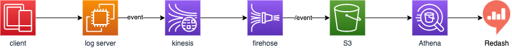
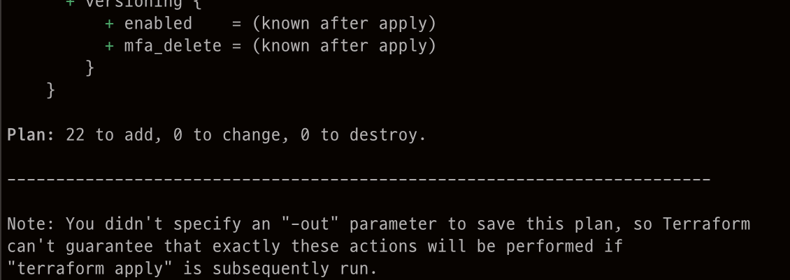

# Stream Log Pipeline
### 1. 시스템 구성도


### 2. 실행
#### 2.1 서버 실행
ES는 AWS Elasticsearch service가 아닌 docker로 대체함
서버 실행  
```
docker-compose up
```

#### 2.2 AWS 리소스 생성
provider.tf 파일 생성
```
vi ./terraform/provider.tf 

terraform {
  required_providers {
    aws = {
      source  = "hashicorp/aws"
      version = "~> 3.0"
    }
  }
}

# Configure the AWS Provider
provider "aws" {
  region = "ap-northeast-2"
  access_key = "access_key" aws access key
  secret_key = "secret key" aws secret key
}
```
Terraform Initializing
```
./terraform/

terraform init 
```
aws 리소스 셍성 계획 확인
```
./terraform/

terraform plan
```
위 명령어를 실행하면 아래와 같이 생성 리소스를 확인할 수 있다.



aws 리소스 생성
```
./terraform/

terraform apply -auto-approve
```

### 3. 테스트
#### 3.1 테스트 설정
기본 테스트는 kinesis가 없더라도 확인할 수 있도록 설정되어 있다.
kinesis를 통한 파이프라인 시험은 코드를 바꿔주어야한다.

##### DEBUG True-> False
```
configuration.py

class Config(object):
    # AWS 설정
    AWS_REGION = "ap-northeast-2"

    # 키네시스 스트림
    KINESIS_DATA_STREAM_TO_S3 = "kinesis-stream-to-s3"
    KINESIS_DATA_STREAM_TO_ES = "kinesis-stream-to-es"
    KINESIS_DATA_STREAM_ERROR_TO_S3 = "error-kinesis-stream-to-s3"

class development(Config):

    # 엘라스틱 서치 설정
    # docker elasticsearch로 대체
    ES_EVENT_LOG_HOST = "http://elasticsearch:9200" # aws elasticsearch service domain
```

#### 3.2 테스트
1. event
    ```
    ./test_event.sh 
    ```
    Response
    ```
    {"status": 200}
    ```


